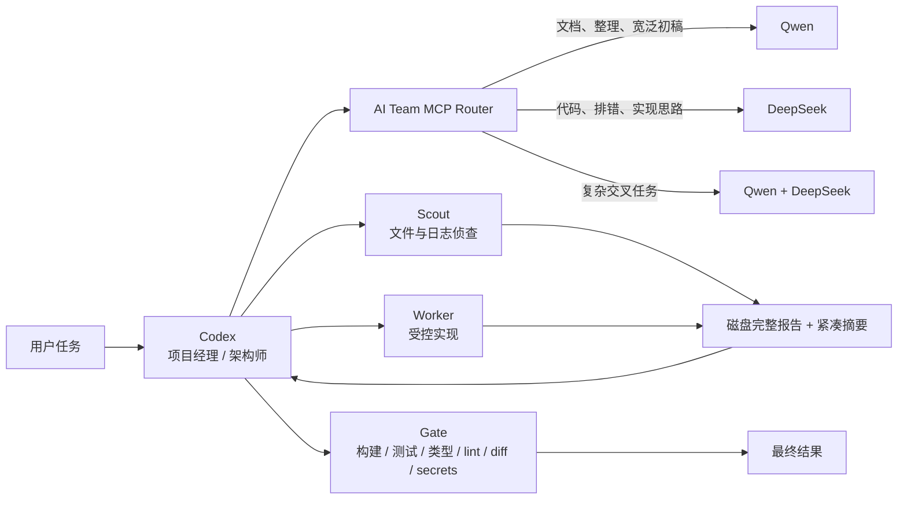

# Codex AI Team Router

让 Codex 做项目经理和最终审稿人，把大范围搜索、初步分析、重复脚本、测试草稿和部分实现工作交给 Qwen / DeepSeek。

项目通过一个轻量 MCP Router 自动选择副手，并用本地 PowerShell 脚本完成项目侦查、受控执行和验收报告。完整过程保存在磁盘中，Codex 只接收紧凑摘要，避免命令输出和长日志持续撑大主对话上下文。

> 目标不是追求最低 token，而是在能力、速度、费用和上下文体积之间取得实用平衡。

## 工作模式



角色划分：

- **Codex**：拆任务、做架构判断、整合结果、最终回复。
- **Qwen**：整理、总结、文档、测试草稿、宽泛第一遍调查。
- **DeepSeek**：代码分析、bug 假设、实现草稿、diff 审查。
- **Scout / Worker / Gate**：本地机械工作，完整记录落盘，只把必要摘要交给 Codex。

## 为什么只保留一个 MCP

为 Qwen 和 DeepSeek 各加载一套 MCP，会让每个 Codex 会话都携带更多工具定义和参数说明。本项目只暴露两个工具：

- `delegate_task`：自动路由任务；`dry_run=true` 时只预览路由，不调用模型。
- `worker_gate_review`：对 worker 产生的 diff 做轻量验收。

Qwen 和 DeepSeek 仍然是两条独立模型线路，只是通过一个入口调度。

## 主要特性

- 自动路由至 Qwen、DeepSeek 或双轨并行。
- `dry_run` 路由预览，不消耗模型 API。
- 三档输出预算：`low`、`normal`、`deep`。
- MCP 返回结果有字符上限，避免异常长回复进入 Codex 上下文。
- Worker 完整输出写入磁盘，默认仅返回最多 30 行 / 3000 字符摘要。
- Scout 专门处理大目录、日志、文件定位和第一遍项目调查。
- Gate 检查构建、测试、类型检查、lint、diff 大小、依赖变化和密钥痕迹。
- API key 只从环境变量读取，不写入代码或 Codex 配置示例。
- Router 基于 Node.js；本地 worker 脚本面向 Windows PowerShell。

## 仓库结构

```text
codex-ai-team-router/
├─ mcp-server/
│  ├─ server.mjs          # Qwen / DeepSeek MCP 总控路由器
│  ├─ smoke-test.mjs      # 不调用 API 的冒烟测试
│  └─ package.json
├─ scripts/
│  ├─ codex-scout.ps1     # 只读侦查，返回短结论
│  ├─ codex-worker.ps1    # Qwen Code / Claude Code-DeepSeek 执行器
│  └─ codex-gate.ps1      # 本地验收脚本
├─ examples/
│  ├─ AGENTS.md
│  └─ config.toml.example
├─ install.ps1
└─ README.md
```

## 前置条件

MCP Router：

- Node.js 20 或更高版本
- npm
- Codex Desktop 或支持本地 MCP server 的 Codex 环境
- 至少配置一个模型 API key

可选 Worker：

- Qwen Code CLI，用于 Qwen agent 模式
- Claude Code CLI，用于通过 Anthropic 兼容接口调用 DeepSeek agent 模式
- Git，用于 diff 与仓库检查
- 项目自身需要的 npm / Python / 编译工具

## 安装

```powershell
git clone https://github.com/kennedymike936-lang/codex-ai-team-router.git
cd codex-ai-team-router
powershell -NoProfile -ExecutionPolicy Bypass -File .\install.ps1
```

安装脚本会：

1. 检查 Node.js 和 npm。
2. 在 `mcp-server` 中安装 MCP SDK。
3. 运行不调用 Qwen / DeepSeek API 的冒烟测试。
4. 输出 Node 和 MCP server 的绝对路径。

## API 环境变量

不要把密钥写入仓库、README、`config.toml` 或 worker prompt。

Qwen 按以下顺序读取：

```text
DASHSCOPE_API_KEY
OPENAI_API_KEY
QWEN_API_KEY
```

DeepSeek 按以下顺序读取：

```text
ANTHROPIC_API_KEY
ANTHROPIC_AUTH_TOKEN
DEEPSEEK_API_KEY
```

Windows 用户级环境变量示例：

```powershell
[Environment]::SetEnvironmentVariable("DASHSCOPE_API_KEY", "YOUR_KEY", "User")
[Environment]::SetEnvironmentVariable("ANTHROPIC_API_KEY", "YOUR_KEY", "User")
```

设置后需要重启 Codex，使桌面进程重新读取环境变量。

## 接入 Codex

打开 `~/.codex/config.toml`，参考 [examples/config.toml.example](examples/config.toml.example) 添加 MCP server。

Windows 示例：

```toml
[mcp_servers.ai_team_mcp]
command = 'C:\Program Files\nodejs\node.exe'
args = ['C:\absolute\path\codex-ai-team-router\mcp-server\server.mjs']
startup_timeout_sec = 60

[mcp_servers.ai_team_mcp.env]
QWEN_MCP_BASE_URL = 'https://dashscope.aliyuncs.com/compatible-mode/v1'
QWEN_MCP_MODEL = 'qwen3.7-plus'
DEEPSEEK_MCP_BASE_URL = 'https://api.deepseek.com/anthropic'
DEEPSEEK_MCP_MODEL = 'deepseek-v4-pro[1m]'
```

用下面的命令查找 Node 绝对路径：

```powershell
(Get-Command node).Source
```

重启 Codex 后，工具列表中应出现：

```text
delegate_task
worker_gate_review
```

## MCP 使用示例

自动路由：

```json
{
  "task": "分析这个 TypeScript 报错并给出最小修复方案",
  "preferred": "auto",
  "budget": "low"
}
```

只看路由，不调用 API：

```json
{
  "task": "整理项目结构并起草 README",
  "preferred": "auto",
  "dry_run": true
}
```

强制双轨：

```json
{
  "task": "比较两种架构并检查代码风险",
  "preferred": "both",
  "budget": "normal"
}
```

## Scout：把大范围调查交给副手

Scout 不修改文件，适合：

- 搜索项目入口和关键模块
- 查找某段功能位于哪些文件
- 阅读大量日志并只返回相关行
- 给陌生项目做第一遍结构调查

```powershell
powershell -NoProfile -ExecutionPolicy Bypass -File .\scripts\codex-scout.ps1 `
  -Task "查找登录流程、关键文件和相关测试，只返回路径和关键行" `
  -Cwd "C:\path\to\project" `
  -Worker auto
```

完整结果默认保存在：

```text
%USERPROFILE%\.codex-ai-team\runs
```

Codex 终端只接收紧凑摘要。

## Worker：受控执行任务

```powershell
powershell -NoProfile -ExecutionPolicy Bypass -File .\scripts\codex-worker.ps1 `
  -Worker qwen `
  -Task "在 src/utils 中补齐重复的输入校验，并运行已有测试" `
  -Cwd "C:\path\to\project" `
  -Approval auto `
  -MaxWallTime 8m
```

DeepSeek worker：

```powershell
powershell -NoProfile -ExecutionPolicy Bypass -File .\scripts\codex-worker.ps1 `
  -Worker deepseek `
  -Task "定位失败测试并提交最小修复" `
  -Cwd "C:\path\to\project" `
  -DeepSeekMaxBudgetUsd 0.03
```

`yolo` 会绕过更多确认，只应在低风险、可恢复的工作区使用。默认推荐 `auto`。

## Gate：轻量验收

```powershell
powershell -NoProfile -ExecutionPolicy Bypass -File .\scripts\codex-gate.ps1 `
  -Cwd "C:\path\to\git-project"
```

Gate 会尽可能检查：

1. 代码能否构建或运行
2. 测试能否通过
3. 类型检查能否通过
4. lint 能否通过
5. 是否修改敏感或禁止文件
6. diff 是否过大
7. 是否改动依赖文件
8. diff 是否包含疑似 API key / private key

Gate 依赖 Git diff；非 Git 目录会返回 `CHECK`，而不是误报 `PASS`。

## Token 节省原理

项目主要减少的是 **Codex 对话上下文增长**，并不保证降低所有模型的总费用：

- 大目录和日志先由外部 worker 调查。
- 完整 worker 过程留在磁盘，不重复塞进 Codex。
- Codex 只拿结论、路径、行号和短摘要。
- 一个 MCP Router 代替两套重复的模型工具定义。
- 简单任务默认使用较小输出预算。
- 低风险结果不强制进行第二次模型审查。

在一次本地调试记录中，未限制输出时上下文曾从约 18k 增长到 153k；第一轮输出优化后，同类过程约增长到 63k。这个数字只用于说明长工具输出的影响，不是通用 benchmark，也不代表你的账户一定获得同样比例的节省。

## 安全说明

- 本项目不会把 API key 写入源代码。
- MCP 和脚本会读取用户环境变量中的 key。
- Worker 能运行工具并修改工作区，运行前应确认目标目录正确。
- 完整 worker 日志可能包含任务中出现的敏感信息，**项目不会自动保证日志脱敏**。
- 不要把 `.env`、私钥、支付数据、账号凭据或私人聊天内容交给外部模型。
- 建议在 Git 仓库或有备份的目录中运行 worker。
- 发布或分享 `runs` 目录前应人工检查内容。

## 可选路径变量

如果 Node、Git、Qwen Code 或 Claude Code 不在系统 PATH，可设置：

```text
AI_TEAM_NODE_DIR
AI_TEAM_GIT_DIR
AI_TEAM_TOOLS_DIR
```

脚本也会自动尝试 `%APPDATA%\npm`。

## 故障排查

### Codex 中看不到 MCP 工具

- 检查 `command` 和 `args` 是否都是绝对路径。
- 运行 `npm run smoke`。
- 修改 `config.toml` 后重启 Codex。

### Qwen 请求失败

- 检查 `DASHSCOPE_API_KEY`。
- 检查模型名和百炼兼容模式 endpoint。
- 确认账户所在地域与模型权限匹配。

### DeepSeek 请求失败

- 检查 `ANTHROPIC_API_KEY` 或 `ANTHROPIC_AUTH_TOKEN`。
- 确认接口支持 Anthropic Messages 兼容格式。
- 根据服务商实际模型名调整 `DEEPSEEK_MCP_MODEL`。

### Worker 卡住或输出过长

- 降低 `MaxWallTime`。
- 使用 Scout 先做只读调查。
- 检查 `%USERPROFILE%\.codex-ai-team\runs` 中的完整结果。
- 将 `SummaryLines` 和 `SummaryMaxChars` 保持在较小范围。

## 设计取舍

- MCP Router 尽量轻量，没有引入完整多 agent 框架。
- 路由规则是启发式，不会永远选中最合适的模型。
- PowerShell worker 主要面向 Windows；MCP Router 本身基于 Node.js，改造后可在其他系统运行。
- 工具描述和返回内容刻意保持短小，以降低长期上下文负担。

## License

[MIT](LICENSE)
