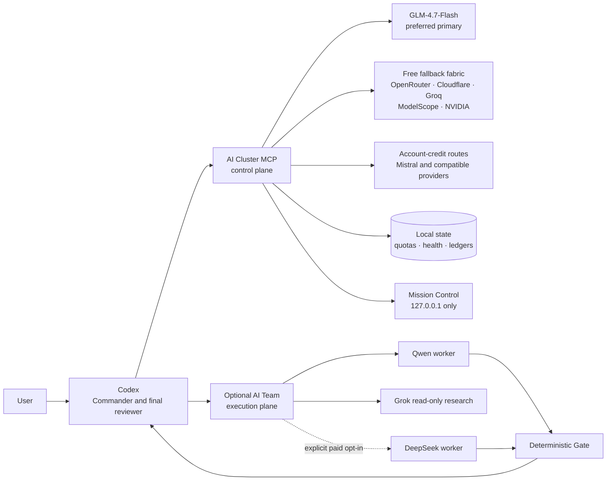

# Codex AI Cluster

**GLM-first, free-tier-aware multi-provider inference for Codex — with an optional bounded AI Team execution plane.**

[](https://github.com/kennedymike936-lang/codex-ai-team-router/releases/tag/v1.0.0)
[](LICENSE)
[](mcp-server/package.json)
[](scripts/)

Codex AI Cluster is a local MCP control plane that discovers, ranks, calls, and fails over across multiple model providers while keeping Codex in command. Its default policy prefers **Zhipu GLM-4.7-Flash**, then consumes verified free pools and account-specific allowances before any paid route is considered.

Version 1.0 is a major architectural boundary. The old “AI Team Router” has become two explicit layers:

- **AI Cluster** is the inference control plane: model discovery, capability routing, quotas, health, circuit breakers, ledgers, and local observability.
- **AI Team** is an optional execution plane: bounded local project workers, read-only research, single-writer implementation, and deterministic validation.

The GitHub repository keeps its historical URL, but the product, MCP server, package, and deployment identity are now **Codex AI Cluster**.

> Free plans, model catalogs, and provider rate limits can change without notice. The router combines dated built-in metadata with live account discovery; provider dashboards and responses remain the source of truth.

## Why a cluster instead of only a team?

| Concern | AI Cluster control plane | Optional AI Team execution plane |
|---|---|---|
| Primary job | Select and operate inference capacity | Perform a bounded local project phase |
| Unit of routing | Provider, model, capability, quota, health | Scout, planner, worker, reviewer |
| Local file access | None for `budget_route` | Explicit `cwd` and optional `allowed_paths` |
| Failure handling | Cooldown, circuit state, safe provider failover | Retry once, deterministic Gate, Codex takeover |
| Cost policy | GLM-first and free-first | Qwen-first; paid DeepSeek only by explicit opt-in |
| Observability | Sanitized provider/model events and quota state | Sanitized assignments, challenges, results, and Gate decisions |

This separation lets the same free inference pool serve drafts, comparisons, coding assistance, and future workers without pretending that every model call is a filesystem-capable “agent.”

## Architecture



## What v1.0 provides

- **GLM-first routing.** `glm-4.7-flash` receives an explicit routing preference while still being subject to capability, health, quota, and policy checks.
- **Free-tier-aware provider fabric.** Zhipu, OpenRouter, Cloudflare Workers AI, Groq, ModelScope, NVIDIA NIM, Mistral, Gemini, SiliconFlow, OpenAI, and generic OpenAI-compatible endpoints share one MCP surface.
- **Live discovery with conservative metadata.** Account-visible `/models` results are merged with a small, dated policy catalog. Unknown prices are never silently labeled free.
- **Persistent resilience.** SQLite-backed request records, cooldowns, provider health, queue state, and circuit state survive process restarts.
- **Safe failover rules.** Execution may move to the next eligible model on quota/capacity responses, rate limits, empty output, or server failures. Authentication and permission failures stop the route instead of leaking requests across providers.
- **Hard local free-pool budgets.** The configured OpenRouter pool is capped at 50 calls per UTC day: GLM 5.2 (10), Inkling (10), North Mini Code (20), and Nemotron Ultra (10).
- **Cloudflare free-plan awareness.** Gemma 4 26B and Nemotron 3 120B share the configured 10,000-neuron daily free allocation and hard-stop policy.
- **Paid-model containment.** DeepSeek is manual-only by default. It is selected only with `preferred=deepseek`, `allow_paid_fallback=true`, or `worker_failover=true` where supported.
- **Sanitized Mission Control.** The optional local UI shows the model roster, assignments, explicit expert debate, provider transitions, and quota state without prompts, credentials, responses, or hidden reasoning.
- **Bounded local work.** AI Team implementation uses read-only planning, a single writing worker, risk-tiered checks, one targeted retry, and Codex takeover on hard failure.
- **Compact handoffs.** Full artifacts stay on disk while Codex receives concise results, reducing main-context usage.

## Default model hierarchy

The exact route depends on requested capabilities, current health, remaining allowance, and live discovery.

| Tier | Provider and configured models | Policy in v1.0 |
|---|---|---|
| Preferred primary | Zhipu `glm-4.7-flash` | Zero-price metadata, 200K context metadata, explicit +25 routing preference |
| Additional GLM capacity | Zhipu `glm-4.6`, `glm-4.5` | Account-dependent; discovered live |
| Daily free pool | OpenRouter GLM 5.2, Inkling, North Mini Code, Nemotron Ultra | Local 10/10/20/10 daily call caps |
| Shared free compute | Cloudflare Gemma 4 26B, Nemotron 3 120B | Shared 10,000-neuron policy |
| Fast free inference | Groq GPT-OSS 120B, Qwen 3.6 27B | Provider free-plan metadata |
| Community inference | ModelScope GLM 4.7 Flash, DeepSeek V4 Flash, Step 3.7 Flash | Daily free-call metadata; discovered live |
| Large-model reserve | NVIDIA Nemotron 3 Ultra 550B | Hosted developer access; discovered live |
| Promotional credit | Mistral Devstral, Mistral Vibe CLI Fast | Never treated as permanently free |
| Optional integrations | Gemini, SiliconFlow, OpenAI, OpenAI-compatible | Used only when configured and policy-eligible |

`free_only` requires confirmed zero input and output prices. A promotional credit or unknown price does not qualify.

## MCP tools

| Tool | Purpose |
|---|---|
| `budget_route` | Preview or execute capability-aware routing across the provider fabric |
| `fabric_status` | Inspect sanitized provider queues, circuits, quotas, and local state |
| `mission_control` | Start, stop, or inspect the local Mission Control UI |
| `doctor` | Check runtime, worker harnesses, provider configuration presence, and trusted proxy state without model calls |
| `delegate_task` | Delegate model-only drafts or analysis; Qwen is free-first and DeepSeek is opt-in |
| `grok_search` | Perform read-only live Web/X research with citations and reported cost |
| `project_task` | Delegate one bounded local inspect or implementation phase and optionally run the Gate |
| `routine_workpack` | Process up to 12 routine chores through read-only and single-writer lanes |
| `worker_gate_review` | Review ambiguous structured results or an explicitly supplied diff |

## Requirements

- Node.js 20 or later
- npm
- Codex Desktop or another MCP-compatible client
- At least one supported provider credential
- Windows PowerShell, Git, and optional Qwen/Claude Code harnesses for the AI Team execution plane

Model-only cluster routing is Node-based. The bundled local project workers currently target Windows PowerShell.

## Install

```powershell
git clone https://github.com/kennedymike936-lang/codex-ai-team-router.git
cd codex-ai-team-router
powershell -NoProfile -ExecutionPolicy Bypass -File .\install.ps1
```

The installer uses the lockfile, runs the offline test suite, and prints the absolute Node and MCP server paths.

To create a separate runtime copy:

```powershell
powershell -NoProfile -ExecutionPolicy Bypass -File .\install.ps1 -DeployRoot "D:\AI-Cluster"
```

In v1.0 the deployed server directory is `ai-cluster-mcp-server`.

## Configure Codex

Copy [examples/config.toml.example](examples/config.toml.example) and replace both paths with absolute paths:

```toml
[mcp_servers.ai_cluster_mcp]
command = 'C:\Program Files\nodejs\node.exe'
args = ['C:\absolute\path\codex-ai-team-router\mcp-server\server.mjs']
startup_timeout_sec = 60

[mcp_servers.ai_cluster_mcp.env]
ZHIPU_BASE_URL = 'https://open.bigmodel.cn/api/paas/v4'
OPENROUTER_MCP_BASE_URL = 'https://openrouter.ai/api/v1'
GROQ_BASE_URL = 'https://api.groq.com/openai/v1'
```

Credentials are read from the Codex process environment or the Windows user environment. Keep values out of the repository and config example.

| Provider | Credential environment variables |
|---|---|
| Zhipu | `ZHIPU_API_KEY` |
| OpenRouter | `OPENROUTER_API_KEY` |
| Cloudflare | `CLOUDFLARE_ACCOUNT_ID` plus `CLOUDFLARE_API_TOKEN` or `CLOUDFLARE_AUTH_TOKEN` |
| Groq | `GROQ_API_KEY` |
| ModelScope | `MODELSCOPE_API_KEY` |
| NVIDIA | `NVIDIA_API_KEY` or `NVIDIA_NIM_API_KEY` |
| Mistral | `MISTRAL_API_KEY` |
| Gemini | `GEMINI_API_KEY` or `GOOGLE_API_KEY` |
| SiliconFlow | `SILICONFLOW_API_KEY` |
| OpenAI | `OPENAI_API_KEY` |
| Generic compatible endpoint | `OPENAI_COMPATIBLE_API_KEY` |
| Qwen execution worker | `DASHSCOPE_API_KEY`, `QWEN_API_KEY`, or legacy compatible configuration |
| DeepSeek execution worker | `DEEPSEEK_API_KEY`, `ANTHROPIC_API_KEY`, or `ANTHROPIC_AUTH_TOKEN` |
| Grok research | `XAI_API_KEY` |

Restart Codex after changing user-scoped environment variables.

## Route examples

Preview the GLM-first free route without making a model call:

```json
{
  "task": "Review this API design and identify the three largest risks.",
  "mode": "free_only",
  "requirements": { "capabilities": ["code"] },
  "providers": ["zhipu", "openrouter", "cloudflare", "groq"],
  "dry_run": true
}
```

Execute the route with provider-aware thinking disabled:

```json
{
  "task": "Draft a compact TypeScript implementation plan.",
  "mode": "free_only",
  "thinking": "disabled",
  "max_tokens": 1200,
  "dry_run": false
}
```

Delegate a bounded local implementation through the optional AI Team layer:

```json
{
  "task": "Fix the failing login validation and run existing checks.",
  "cwd": "C:\\path\\to\\project",
  "mode": "implement",
  "allowed_paths": ["src/auth", "tests"],
  "budget": "low",
  "run_gate": true,
  "worker_failover": false
}
```

## Mission Control

Call `mission_control` with `{"action":"start"}` to open the optional observer surface. It binds only to `127.0.0.1`. The right-hand roster lists configured cluster models and reports the local daily remainder where the router has an enforceable request cap.

The **Expert debate** view shows only explicit proposals, challenges, citations, assignments, and decisions. It intentionally does not expose hidden chain-of-thought. Prompts, credentials, raw responses, and private artifacts never enter this surface.

## Reliability and safety boundaries

- `budget_route` defaults to `dry_run=true`.
- A free route never silently crosses into a paid model.
- Authentication/permission failures do not trigger provider failover.
- Provider cooldowns prevent repeatedly spending calls on an unhealthy route.
- Local project implementation is single-writer and can be isolated in a temporary Git worktree.
- The Gate checks relevant build/test/type/lint commands, changed scope, diff size, dependency changes, and secret-like content.
- A Gate score of 90 or higher is accepted; 80–89 may receive one targeted retry; lower scores or hard failures return control to Codex.
- Workers and project scripts execute with the current user's permissions. The Gate is not an operating-system sandbox.

Read [SECURITY.md](SECURITY.md) before using local workers on sensitive or untrusted projects.

## Local validation

The default suite is offline and does not intentionally call provider APIs:

```powershell
cd mcp-server
npm ci
npm test
```

Live probes are separate opt-in commands and can consume provider quota.

## Migrating from 0.x

1. Pull the new default branch and run `install.ps1` again.
2. Rename the Codex MCP entry from `ai_team_mcp` to `ai_cluster_mcp` when adopting the new example.
3. If using `-DeployRoot`, update the server path from `ai-team-mcp-server` to `ai-cluster-mcp-server`.
4. Restart Codex so it loads MCP server identity `ai-cluster-mcp-server` version `1.0.0`.
5. Keep existing `AI_TEAM_*` environment variables for now; v1.0 retains them as compatibility names.
6. Review paid fallback settings. DeepSeek no longer participates in automatic routing unless explicitly enabled for that request.

See [CHANGELOG.md](CHANGELOG.md) for the complete release summary and [ARCHITECTURE.md](ARCHITECTURE.md) for design invariants.

## Contributing and license

Read [CONTRIBUTING.md](CONTRIBUTING.md) before opening a pull request. Security reports belong in GitHub private vulnerability reporting, not a public issue.

Codex AI Cluster is released under the [MIT License](LICENSE).
