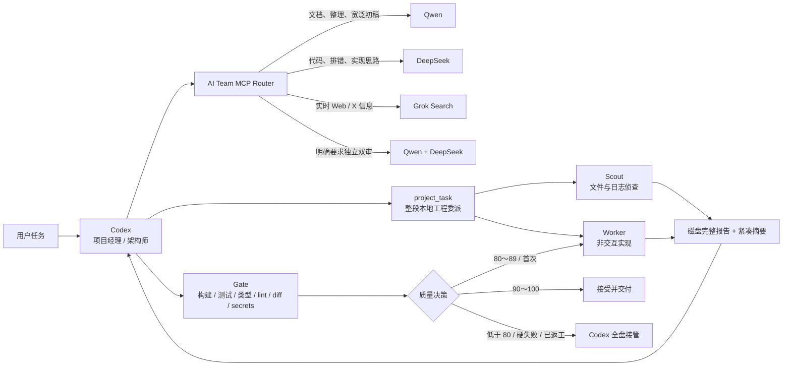

# Codex AI Team Router

[English](README.en.md) | 简体中文

让 Codex 做项目经理和最终审稿人，把文档与初步分析交给 Qwen、代码杂活交给 DeepSeek，把实时 Web / X 信息侦查交给 Grok Search。

项目通过一个轻量 MCP Router 自动选择副手，并用本地 PowerShell 脚本完成项目侦查、受控执行和验收报告。完整过程保存在磁盘中，Codex 只接收紧凑摘要，避免命令输出和长日志持续撑大主对话上下文。

> 目标不是追求最低 token，而是以合理成本稳定交付 90～95 分的结果；低于质量底线时，Codex 立即接管。

## 工作模式



角色划分：

- **Codex**：拆任务、做架构判断、整合结果、最终回复。
- **Qwen**：整理、总结、文档、测试草稿、宽泛第一遍调查。
- **DeepSeek**：代码分析、bug 假设、实现草稿、diff 审查。
- **Grok Search**：只读搜索 X 或 Web，返回实时结论、引用和实际扣费，不修改项目。
- **Scout / Worker / Gate**：本地机械工作，完整记录落盘，只把必要摘要交给 Codex。

## 为什么只保留一个 MCP

为每个模型各加载一套 MCP，会让每个 Codex 会话携带更多工具定义。本项目只保留一个 MCP，并暴露五个紧凑工具：

- `delegate_task`：处理不需要本地文件工具的问答、草稿和分析；按任务复杂度自动选择一个或两个代码 Worker，复杂且依赖实时资料时再加入 Grok。
- `grok_search`：一次只读 Web Search 或 X Search，`source=auto` 时一般实时资讯走 Web、帖子和舆论走 X；默认限制一个服务端工具回合。
- `budget_route`：在用户主动配置的 OpenRouter、Groq、Gemini、OpenAI Responses 或管理员配置的 OpenAI-compatible 服务范围内，按能力、已知价格、隐私、延迟、健康状态和剩余限额解释并选择模型；默认只预览。
- `project_task`：把一整段本地侦查或实现交给自动扩编的 Qwen/DeepSeek 团队；实现后可自动运行确定性 Gate，只把交接包返回 Codex。
- `worker_gate_review`：对结构化结果做确定性质量决策，也兼容原有的 diff 轻量审查。

三个服务商仍是独立线路，只通过一个入口调度。

## 主要特性

- 自动按任务长度、验收项、架构范围、风险、跨领域数量和交互系统数量判定 `small / medium / complex`：小任务 1 个助手，复杂单页游戏等中大型任务会增加只读规划助手，复杂且需要实时资料时最多 3 个助手。
- 多助手实现采用“只读规划/侦查 -> 单个 Worker 写入 -> Gate 验收”，两个代码助手不会并发修改同一个工作目录。
- `project_task` 把文件发现、批量编辑和验证合并成一个 MCP 回合，避免 Codex 自己形成几十次 shell 循环。
- Grok Search 默认 `max_turns=1`、关闭并行工具，只允许 X 或 Web 二选一，控制搜索调用费用。
- 默认从服务商 `/models` 接口发现账号当前可用模型，并按代际与 `Flash / Plus / Pro` 档位自动选择。
- 模型列表缓存一小时；新一代稳定别名上线后无需修改配置，模型不可用时同服务商最多回退一次。
- `dry_run` 路由预览不发送生成请求；`budget_route` 仍可能读取服务商 `/models` 元数据。
- 三档输出预算：`low`、`normal`、`deep`。
- MCP 返回结果有字符上限，避免异常长回复进入 Codex 上下文。
- Worker 完整输出写入磁盘，默认仅返回最多 30 行 / 3000 字符摘要。
- 只读 Scout 默认最多 4 个 agent 回合；实现 Worker 默认最多 8 个回合。
- Scout 专门处理大目录、日志、文件定位和第一遍项目调查。
- Gate 检查构建、测试、类型检查、lint、HTML 内联脚本语法、diff 大小、依赖变化和密钥痕迹。
- 质量策略固定为：90 分以上接受、80～89 分只返工一次、低于 80 分由 Codex 接管。
- `project_task` 在首次 Gate 返回 `retry` 时会在同一个 MCP 调用内自动执行一次定向返工，并合并两轮修改和用量；第二轮仍不合格才交给 Codex。
- Scout/Worker 遇到轮次上限、超时、429/5xx、进程或结构化输出故障时，最多自动切换一次到独立助手/外壳；认证、权限、Key 配置和安全错误立即停止。
- 联网请求会区分 DNS、连接超时/拒绝、网络不可达、连接重置、TLS 和请求超时；安全可重放的失败最多重试一次，付费 POST 在送达状态不明时不会自动重放。
- 构建/测试失败、密钥痕迹、越界修改等硬故障会跳过返工，立即要求 Codex 接管。
- Worker 和 Gate 都生成 JSON 交接文件，Codex 接手时无需重新扫描整个项目。
- 没有首次提交的 Git 仓库使用 `unborn` 基线，不再误判为非 Git 项目。
- API key 只从环境变量读取，不写入代码或 Codex 配置示例。
- Router 基于 Node.js；本地 worker 脚本面向 Windows PowerShell。

## 自动模型选择

默认 `AI_TEAM_MODEL_MODE=auto`，固定的模型名称不是必填配置。MCP 和 PowerShell Worker 都会先读取账号可见的 `/models` 列表，然后：

| 预算 | Qwen | DeepSeek |
|---|---|---|
| `low` | 最新稳定 `flash` | 最新稳定 `flash` |
| `normal` | 最新稳定 `plus` | 最新稳定 `pro` |
| `deep` | 最新稳定 `plus` | 最新稳定 `pro` |

Grok Search 另外读取 xAI `/language-models` 的账号可见模型和实时价格。它优先稳定的文本非推理模型，再按输入/输出价格排序；如果候选模型不支持搜索，才回退到下一个同账号模型。当前账号实测优先 `grok-4.20-0309-non-reasoning`，未来模型升级后不需要手改版本号。

选择器按模型家族和数字代际判断，不把某个版本号永久写死。例如未来出现 `qwen3.8-plus` 或 `deepseek-v5-flash`，只要它出现在账号可用列表中，就会优先于旧代稳定模型。`preview`、实时、语音、视觉等不适合当前文本/代码 Worker 的变体会被排除。

模型列表接口暂时不可用时，系统才使用内置保底名单；普通认证失败、限流或服务错误不会触发乱换模型。只有明确的“模型不存在/无权限”错误允许同服务商回退一次。

如确实需要锁定模型，可配置：

```toml
[mcp_servers.ai_team_mcp.env]
AI_TEAM_MODEL_MODE = 'fixed'
QWEN_MCP_MODEL = 'your-model-id'
DEEPSEEK_MCP_MODEL = 'your-model-id'
```

内置价格只用于估算，实际账单以服务商和地区为准。默认档位参考 [阿里云百炼模型价格](https://help.aliyun.com/zh/model-studio/model-pricing) 和 [DeepSeek 官方模型价格](https://api-docs.deepseek.com/zh-cn/quick_start/pricing)。

## v0.7 预算感知路由与 v0.8 Provider Registry 预览

`budget_route` 与原有 AI Team Worker 路由相互独立，不会改变 `delegate_task` 的行为。它支持：

- `free_only`：只接受输入、输出价格都由模型元数据明确标为零的候选；Groq 的开发者限额不会被误判成零价格。
- `balanced`：综合能力、价格、上下文、延迟、健康状态和剩余限额。
- `quality_first`：提高显式质量与能力元数据的权重，但仍执行预算、能力和隐私硬约束。

默认 `dry_run=true`。预览结果包含所有候选、排除原因、分项得分、最终选择和备用链。只有显式设置 `dry_run=false` 才发送生成请求。OpenRouter、Groq、SiliconFlow 和通用 OpenAI-compatible 端点使用 Chat Completions；Gemini 使用原生 `generateContent`。路由仅对明确的额度/限流/容量错误和服务端 `5xx` 安全降级；`400`、`401`、`403` 及其他客户端错误立即停止。`Retry-After` 会记录在尝试结果中，但路由器不会自动休眠。

能力和隐私采用保守策略：缺失的 `code`、`tools`、`web` 或零数据保留元数据不会被推断为支持。可用 `AI_TEAM_MODEL_METADATA_JSON` 为具体模型补充经过你核实的元数据，例如：

```toml
[mcp_servers.ai_team_mcp.env]
AI_TEAM_MODEL_METADATA_JSON = '{"openrouter:vendor/model":{"capabilities":["code","tools"],"is_zero_data_retention":true,"quality_score":0.8}}'
AI_TEAM_OPENROUTER_FREE_FALLBACK = 'false'
```

`openrouter/free` 只在 `AI_TEAM_OPENROUTER_FREE_FALLBACK=true` 时加入 `free_only` 候选，并继续接受能力、上下文和隐私过滤。免费模型、价格和限额会变化，路由器不会写死额度数字或承诺可用性。

v0.8 的 Provider Registry 将供应商与协议分离。内置注册项为 `openrouter`、`groq`、`gemini`、`siliconflow`、`openai` 和 `openai_compatible`。OpenAI 使用原生 Responses API；通用端点继续使用 Chat Completions，并允许无需 Key 的本地服务。Base URL 只能由维护者通过环境变量配置，`budget_route` 调用者不能传入任意 URL。Gemini 免费/未付费服务不会被标记为零数据保留；隐私敏感任务会默认排除，除非管理员依据适用合同明确覆盖元数据。

SiliconFlow 是独立的云端数据与内容政策边界，不会因为模型 ID 中含有 Qwen、DeepSeek 等名称而被当成模型厂商直连。它不在默认 Provider 列表中，必须在 `providers` 中显式选择。其价格、免费状态和能力不会从模型名称猜测；`free_only` 只接受管理员为具体模型核实并补充的零价格元数据。涉及凭证、私有代码、个人数据等内容时设置 `sensitive=true`；涉及受供应商或司法辖区内容规则约束的话题时设置 `policy_sensitive=true`，SiliconFlow 候选会以明确原因被排除。不要利用模型切换规避供应商政策或适用法律。

## 仓库结构

```text
codex-ai-team-router/
├─ mcp-server/
│  ├─ server.mjs          # Qwen / DeepSeek MCP 总控路由器
│  ├─ quality-policy.mjs  # 确定性质量评分和接管状态机
│  ├─ model-selector.mjs  # 动态模型发现与性价比选择
│  ├─ usage-ledger.mjs    # Token 与费用本地账本
│  ├─ xai-search.mjs      # Grok Web / X 搜索与自动模型选择
│  ├─ project-task.mjs     # 本地 Scout / Worker / Gate 一体化委派
│  ├─ smoke-test.mjs      # 不调用 API 的冒烟测试
│  ├─ quality-policy-test.mjs
│  └─ package.json
├─ scripts/
│  ├─ codex-scout.ps1     # 只读侦查，返回短结论
│  ├─ codex-worker.ps1    # Qwen Code / Claude Code-DeepSeek 执行器
│  ├─ codex-gate.ps1      # 本地验收与交接包生成器
│  └─ codex-gate-test.ps1
├─ examples/
│  ├─ AGENTS.md
│  └─ config.toml.example
├─ benchmark/             # 8 项隔离训练场和隐藏验收
├─ install.ps1
└─ README.md
```

## 前置条件

MCP Router：

- Node.js 20 或更高版本
- npm
- Codex Desktop 或支持本地 MCP server 的 Codex 环境
- 至少配置一个模型 API key

可选 Worker：

- Qwen Code CLI，用于 Qwen agent 模式
- Claude Code CLI，用于通过 Anthropic 兼容接口调用 DeepSeek agent 模式
- Git，用于 diff 与仓库检查
- 项目自身需要的 npm / Python / 编译工具

## 安装

```powershell
git clone https://github.com/kennedymike936-lang/codex-ai-team-router.git
cd codex-ai-team-router
powershell -NoProfile -ExecutionPolicy Bypass -File .\install.ps1
```

安装脚本会：

1. 检查 Node.js 和 npm。
2. 在 `mcp-server` 中安装 MCP SDK。
3. 运行不调用 Qwen / DeepSeek API 的完整本地测试。
4. 输出 Node 和 MCP server 的绝对路径。

若要维护独立运行副本，可一次同步 MCP 与 PowerShell 脚本，避免源码和部署目录漂移：

```powershell
powershell -NoProfile -ExecutionPolicy Bypass -File .\install.ps1 -DeployRoot "D:\AI-Team"
```

## API 环境变量

不要把密钥写入仓库、README、`config.toml` 或 worker prompt。

Qwen 按以下顺序读取：

```text
DASHSCOPE_API_KEY
OPENAI_API_KEY
QWEN_API_KEY
```

DeepSeek 按以下顺序读取：

```text
ANTHROPIC_API_KEY
ANTHROPIC_AUTH_TOKEN
DEEPSEEK_API_KEY
```

Grok Search 读取：

```text
XAI_API_KEY
```

预算感知路由按所选服务商读取：

```text
OPENROUTER_API_KEY
GROQ_API_KEY
GEMINI_API_KEY
SILICONFLOW_API_KEY
OPENAI_COMPATIBLE_API_KEY
OPENAI_API_KEY
```

Windows 用户级环境变量示例：

```powershell
[Environment]::SetEnvironmentVariable("DASHSCOPE_API_KEY", "YOUR_KEY", "User")
[Environment]::SetEnvironmentVariable("ANTHROPIC_API_KEY", "YOUR_KEY", "User")
[Environment]::SetEnvironmentVariable("XAI_API_KEY", "YOUR_KEY", "User")
[Environment]::SetEnvironmentVariable("OPENROUTER_API_KEY", "YOUR_KEY", "User")
[Environment]::SetEnvironmentVariable("GROQ_API_KEY", "YOUR_KEY", "User")
[Environment]::SetEnvironmentVariable("GEMINI_API_KEY", "YOUR_KEY", "User")
[Environment]::SetEnvironmentVariable("SILICONFLOW_API_KEY", "YOUR_KEY", "User")
```

设置后需要重启 Codex，使桌面进程重新读取环境变量。

### 可信代理与网络回退

路由器不会扫描、下载或自动连接公网免费代理。只有维护者已经通过环境变量明确配置的 HTTP/HTTPS 代理才会被使用：

```text
AI_TEAM_TRUSTED_PROXY_URL   # 可选的专用代理；优先级最高
HTTPS_PROXY / HTTP_PROXY   # 标准可信代理配置
NO_PROXY                   # 绕过代理的主机；localhost/127.0.0.1/::1 始终加入
AI_TEAM_PROXY_MODE         # fallback（默认）、always 或 off
```

`fallback` 先直连，只有 DNS、连接建立超时/拒绝或网络不可达等可安全判断的失败才尝试一次代理。`always` 从第一步就使用已配置代理；`off` 禁止代理。诊断结果只报告是否配置/尝试了代理，不输出代理 URL 或其中的凭证。TLS 错误不会通过关闭证书校验解决。Grok 网络失败会返回结构化 `network_unavailable` 结果，不再退化成无上下文的 MCP `fetch failed`。

## 接入 Codex

打开 `~/.codex/config.toml`，参考 [examples/config.toml.example](examples/config.toml.example) 添加 MCP server。

Windows 示例：

```toml
[mcp_servers.ai_team_mcp]
command = 'C:\Program Files\nodejs\node.exe'
args = ['C:\absolute\path\codex-ai-team-router\mcp-server\server.mjs']
startup_timeout_sec = 60

[mcp_servers.ai_team_mcp.env]
QWEN_MCP_BASE_URL = 'https://dashscope.aliyuncs.com/compatible-mode/v1'
DEEPSEEK_MCP_BASE_URL = 'https://api.deepseek.com/anthropic'
XAI_MCP_BASE_URL = 'https://api.x.ai/v1'
AI_TEAM_PROXY_MODE = 'fallback'
# Optional trusted proxy only. Prefer a user/system environment variable when it contains credentials.
# AI_TEAM_TRUSTED_PROXY_URL = 'http://127.0.0.1:7890'
OPENROUTER_MCP_BASE_URL = 'https://openrouter.ai/api/v1'
GROQ_MCP_BASE_URL = 'https://api.groq.com/openai/v1'
GEMINI_MCP_BASE_URL = 'https://generativelanguage.googleapis.com/v1beta'
SILICONFLOW_MCP_BASE_URL = 'https://api.siliconflow.cn/v1'
# Optional administrator-configured endpoint; never accept this URL from task input.
OPENAI_COMPATIBLE_BASE_URL = 'http://127.0.0.1:1234/v1'
```

不填写模型名即使用自动模式。

用下面的命令查找 Node 绝对路径：

```powershell
(Get-Command node).Source
```

重启 Codex 后，工具列表中应出现：

```text
delegate_task
grok_search
budget_route
project_task
worker_gate_review
```

## MCP 使用示例

自动路由：

```json
{
  "task": "分析这个 TypeScript 报错并给出最小修复方案",
  "preferred": "auto",
  "budget": "low"
}
```

只看路由，不调用 API：

```json
{
  "task": "整理项目结构并起草 README",
  "preferred": "auto",
  "dry_run": true
}
```

强制双轨：

```json
{
  "task": "比较两种架构并检查代码风险",
  "preferred": "both",
  "budget": "normal"
}
```

预览预算感知路由（会读取模型列表，但不发送任务内容给生成接口）：

```json
{
  "task": "检查这段代码的并发问题",
  "mode": "balanced",
  "providers": ["openrouter", "groq"],
  "requirements": {
    "capabilities": ["code", "tools"],
    "min_context_length": 32000,
    "sensitive": false
  },
  "dry_run": true
}
```

把一整段本地实现交给副手并自动验收：

```json
{
  "task": "定位登录失败原因，提交最小修复并运行现有检查",
  "cwd": "C:\\path\\to\\project",
  "mode": "implement",
  "preferred": "auto",
  "max_assistants": 3,
  "allowed_paths": ["src/auth", "tests"],
  "budget": "low",
  "run_gate": true
}
```

只读侦查时把 `mode` 设为 `inspect`。`max_assistants` 是费用上限，不是固定人数；自动调度只会使用必要的助手。`worker_failover` 默认开启：轮次上限、超时、429/5xx、进程或输出解析故障会最多切换一次（Qwen 外壳故障优先改走 `DeepSeek + Claude` 独立外壳），再失败则由 Codex 接管；认证、权限、Key 配置和安全错误不会切换。实现模式默认使用非交互权限，非 Git 目录会先初始化本地 Git 基线；允许路径、Git diff、密钥扫描和项目检查由 Gate 兜底。首次 Gate 只要求返工时，`project_task` 会内部自动完成第二次定向尝试，无需 Codex 再发一次 MCP 请求。完整产物留在 `%USERPROFILE%\.codex-ai-team\runs`，MCP 只返回短摘要和路径。

确定性质量决策（不调用模型 API）：

```json
{
  "evaluation": {
    "task_id": "login-fix-001",
    "attempt": 1,
    "scores": {
      "functionality": 35,
      "requirements": 20,
      "code_quality": 10,
      "safety": 10,
      "maintainability": 10
    },
    "hard_failures": [],
    "summary": "核心流程已修复，但缺少一个边界测试。",
    "changed_files": ["src/login.ts", "test/login.test.ts"]
  }
}
```

该示例得到 85 分，第一次返回 `retry`；相同任务以 `attempt: 2` 再次得到 85 分时返回 `takeover`。

## 质量优先接管策略

质量分用于表达**交付置信度**，不是宣称可以用数学精确衡量代码。评分满分 100：

| 维度 | 分值 |
|---|---:|
| 核心功能、构建和测试 | 40 |
| 需求完成度 | 25 |
| 类型、lint 和代码质量 | 15 |
| 安全与修改范围 | 10 |
| 可维护性 | 10 |

决策规则：

- `90～100`：接受结果，停止无收益的精雕细琢。
- `80～89`：第一次只修失败项；第二次仍未达到 90 分，由 Codex 接管。
- `< 80`：不继续烧 worker token，Codex 直接接管。
- 任意硬故障：无视分数，立即接管。

硬故障包括构建/测试/类型/lint 失败、疑似密钥、禁止文件、超出允许路径、diff 失控和需求明确失败。接管顺序是先恢复可交付状态，再分析 worker 为什么失手；复盘不能阻塞修复。

## Scout：把大范围调查交给副手

Scout 不修改文件，适合：

- 搜索项目入口和关键模块
- 查找某段功能位于哪些文件
- 阅读大量日志并只返回相关行
- 给陌生项目做第一遍结构调查

```powershell
powershell -NoProfile -ExecutionPolicy Bypass -File .\scripts\codex-scout.ps1 `
  -Task "查找登录流程、关键文件和相关测试，只返回路径和关键行" `
  -Cwd "C:\path\to\project" `
  -Worker auto
```

完整结果默认保存在：

```text
%USERPROFILE%\.codex-ai-team\runs
```

Codex 终端只接收紧凑摘要。

## Worker：受控执行任务

```powershell
powershell -NoProfile -ExecutionPolicy Bypass -File .\scripts\codex-worker.ps1 `
  -Worker qwen `
  -Task "在 src/utils 中补齐重复的输入校验，并运行已有测试" `
  -Cwd "C:\path\to\project" `
  -TaskId "input-validation-001" `
  -Attempt 1 `
  -AllowedPath @("src/utils", "test") `
  -Budget low `
  -Approval yolo `
  -MaxWallTime 8m
```

DeepSeek worker：

```powershell
powershell -NoProfile -ExecutionPolicy Bypass -File .\scripts\codex-worker.ps1 `
  -Worker deepseek `
  -Task "定位失败测试并提交最小修复" `
  -Cwd "C:\path\to\project" `
  -DeepSeekMaxBudgetUsd 0.10
```

直接调用脚本时，`auto` 可能在无交互后台拒绝编辑；需要实际实现时使用 `yolo`，并同时设置 `AllowedPath`、保持 Git 可恢复、随后运行 Gate。`project_task` 已把这套流程串联起来。

## Gate：轻量验收

```powershell
powershell -NoProfile -ExecutionPolicy Bypass -File .\scripts\codex-gate.ps1 `
  -Cwd "C:\path\to\git-project" `
  -TaskId "input-validation-001" `
  -Task "补齐输入校验并运行测试" `
  -Attempt 1 `
  -RequirementStatus pass `
  -AllowedPath @("src/utils", "test")
```

Gate 会尽可能检查：

1. 代码能否构建或运行
2. 测试能否通过
3. 类型检查能否通过
4. lint 能否通过
5. 变更的 HTML 内联脚本能否通过语法检查
6. 是否修改敏感或禁止文件
7. diff 是否过大或改动依赖文件
8. diff 是否包含疑似 API key / private key

Gate 会在运行目录下写入：

- `gate.md`：供人阅读的检查报告。
- `handoff.json`：供 Codex 接管的精简状态包，包含任务、分数、失败项、修改文件和完整产物路径。

`RequirementStatus` 可设为 `pass`、`partial`、`unknown` 或 `fail`。只有确认核心需求已完成时才使用 `pass`；`unknown` 会降低置信度并触发一次定向返工。Gate 依赖 Git；没有首次提交的仓库会使用自适应 `unborn` 基线，完全不是 Git 的目录仍会要求 Codex 接管。

## Codex 调用预算

- 非简单项目优先用一次 `project_task` 完成侦查或实现，不先由 Codex 逐文件扫描。
- Codex 连续执行约 8 次本地工具调用仍未形成可验收产物时，应停止扩张上下文，把剩余阶段整包委派。
- Gate 为 `accept` 时，Codex 读取交接摘要即可集成，不再重复读取所有文件和日志。
- `project_task` 收到 Gate 的 `retry` 时会在内部只返工失败项；最终为 `takeover` 时 Codex 读取 `handoff.json` 后接管，不从头调查。
- 小改动、单命令回答和最终架构决策无需为了委派而委派。
- 自动扩编仍以性价比为先：复杂度不足时不会为了凑人数调用第二个模型，Grok 只在任务确实依赖当前外部信息时加入。

直接单独运行 Worker / Gate 脚本时，第二次返工应保持同一个 `TaskId` 并将 `Attempt` 改为 `2`。通过 `project_task` 调用时这一步已自动完成；如果第二轮仍低于 90 分，工具会输出 `takeover`，Codex 直接读取 `handoff.json` 和其中引用的 worker 产物继续工作。

## 成本账本

MCP 请求会记录服务商返回的准确 Token 用量、模型、耗时、是否回退和按公开单价计算的费用估算：

```text
%USERPROFILE%\.codex-ai-team\usage\usage.jsonl
```

xAI 请求还会记录官方 `cost_in_usd_ticks` 换算出的实际美元扣费、服务端搜索次数和引用 URL；该金额已经包含 Token、缓存折扣和搜索工具调用。

Qwen Code Agent 外壳使用结构化 JSON 输出，Worker 账本会记录服务商返回的输入、输出、缓存 Token、回合数和公开单价估算。旧版 Claude Code 兼容外壳仍不提供统一 Token 字段，因此该模式只记录可验证信息，不编造用量：

```text
%USERPROFILE%\.codex-ai-team\usage\worker-runs.jsonl
```

账本中的 `estimated_cost_cny` 只是按仓库价格目录计算的估值；缓存折扣、限时活动、地域和账户阶梯价以服务商账单为准。Worker 的完整结构化响应保存在每次运行目录的 `qwen-result.json`，Codex 默认只读取短摘要。

DeepSeek Worker 默认使用 Qwen Code 的 OpenAI-compatible Agent 外壳，并在每次运行目录中生成不含密钥的临时 Provider 配置，声明 DeepSeek V4 的上下文能力；这避免 Claude Code 对第三方模型费用的错误估算。需要兼容旧流程时可显式传入 `-DeepSeekHarness claude`。

可以手动执行极小的在线探针验证两个账号和自动选择。该命令会产生少量模型费用，不会被 `npm test` 自动执行：

```powershell
cd .\mcp-server
npm run probe:live
```

单独验证 Grok 自动选模、一次搜索限制、引用和实际扣费（会产生一次 xAI 搜索费用）：

```powershell
npm run probe:xai
```

## 8 项训练场

训练场会为每项任务复制独立项目并初始化 Git，不碰真实工程。只准备任务不扣模型 Token：

```powershell
.\benchmark\run-benchmark.ps1 -TaskId T3
```

确认后执行：

```powershell
.\benchmark\run-benchmark.ps1 -TaskId T3 -Execute
```

任务清单、允许路径和验收目标见 [benchmark/tasks.json](benchmark/tasks.json)。代码任务会运行隐藏验收和 Gate，结果保存在 `%USERPROFILE%\.codex-ai-team\benchmark`。

每次代码任务的模型、隐藏验收、质量分、决策和交接路径汇总在：

```text
%USERPROFILE%\.codex-ai-team\benchmark\benchmark-results.jsonl
```

## Token 节省原理

项目主要减少的是 **Codex 对话上下文增长**，并不保证降低所有模型的总费用：

- 大目录和日志先由外部 worker 调查。
- 完整 worker 过程留在磁盘，不重复塞进 Codex。
- Codex 只拿结论、路径、行号和短摘要。
- 一个 MCP Router 代替两套重复的模型工具定义。
- 简单任务默认使用较小输出预算。
- 低风险结果不强制进行第二次模型审查。

在一次本地调试记录中，未限制输出时上下文曾从约 18k 增长到 153k；第一轮输出优化后，同类过程约增长到 63k。这个数字只用于说明长工具输出的影响，不是通用 benchmark，也不代表你的账户一定获得同样比例的节省。

## 安全说明

完整的信任边界、安全使用基线和私密漏洞报告流程见 [SECURITY.md](SECURITY.md)。

- 本项目不会把 API key 写入源代码。
- MCP 和脚本会读取用户环境变量中的 key。
- `budget_route` 不接受 Key 或 Base URL 参数；它只读取管理员配置的环境变量，并对 Bearer、Google 和已知凭证值做错误脱敏。
- 敏感任务默认应设置 `sensitive=true` 或 `require_zero_data_retention=true`；没有显式零数据保留元数据的候选会被排除。
- Worker 能运行工具并修改工作区，运行前应确认目标目录正确。
- 完整 worker 日志可能包含任务中出现的敏感信息，**项目不会自动保证日志脱敏**。
- 不要把 `.env`、私钥、支付数据、账号凭据或私人聊天内容交给外部模型。
- 建议在 Git 仓库或有备份的目录中运行 worker。
- 发布或分享 `runs` 目录前应人工检查内容。

## 可选路径变量

如果 Node、Git、Qwen Code 或 Claude Code 不在系统 PATH，可设置：

```text
AI_TEAM_NODE_DIR
AI_TEAM_GIT_DIR
AI_TEAM_TOOLS_DIR
```

脚本也会自动尝试 `%APPDATA%\npm`。

## 故障排查

### Codex 中看不到 MCP 工具

- 检查 `command` 和 `args` 是否都是绝对路径。
- 运行 `npm run smoke`。
- 修改 `config.toml` 后重启 Codex。

### Qwen 请求失败

- 检查 `DASHSCOPE_API_KEY`。
- 检查模型名和百炼兼容模式 endpoint。
- 确认账户所在地域与模型权限匹配。

### DeepSeek 请求失败

- 检查 `ANTHROPIC_API_KEY` 或 `ANTHROPIC_AUTH_TOKEN`。
- 确认接口支持 Anthropic Messages 兼容格式。
- 运行 `npm run probe:live` 检查账号可见模型和自动选择结果。
- 只有使用 `AI_TEAM_MODEL_MODE=fixed` 时才需要人工检查 `DEEPSEEK_MCP_MODEL`。

### Worker 卡住或输出过长

- 降低 `MaxWallTime`。
- 使用 Scout 先做只读调查。
- 检查 `%USERPROFILE%\.codex-ai-team\runs` 中的完整结果。
- 将 `SummaryLines` 和 `SummaryMaxChars` 保持在较小范围。

## 设计取舍

- MCP Router 尽量轻量，没有引入完整多 agent 框架。
- 路由规则是启发式，不会永远选中最合适的模型。
- PowerShell worker 主要面向 Windows；MCP Router 本身基于 Node.js，改造后可在其他系统运行。
- 工具描述和返回内容刻意保持短小，以降低长期上下文负担。

## License

[MIT](LICENSE)
